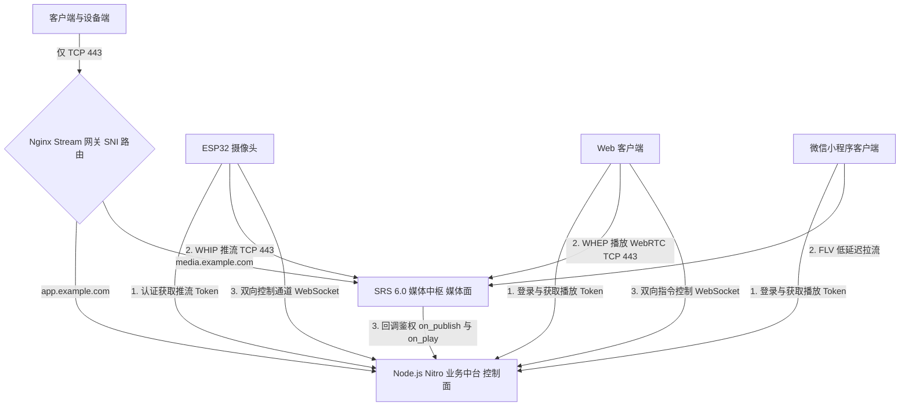

# HomeGuard-RTC 项目总览与架构设计

## 1. 项目愿景与核心定位

**HomeGuard-RTC** 是一款专为家庭安全设计的、具备**工业级安全防御能力**的自主网络监控与设备控制平台。

项目核心宗旨是**“极致隐私、绝对掌控”**。通过以下关键设计，彻底杜绝传统商用摄像头数据泄露、外网扫描窃听的风险，实现可直接平替部署至公网云端的高性能、低延迟监控解决方案：
- **流媒体核心隐藏**：将流媒体服务置于安全网关之后，不直接对外暴露流媒体管理 API。
- **全链路单端口收敛**：通过 Nginx stream 模块，将所有流量（HTTPS Web、WebSocket 控制流、WebRTC over TCP 媒体流）全链路收敛至单 TCP `443` 端口，无公共 UDP 端口暴露。
- **端到端强鉴权 ACL**：采用双层 Token 机制（业务 Token + 短期媒体 Action Token），配合 SRS 内部回调（HTTP Hooks）实时进行流媒体鉴权。
- **控制面与媒体面解耦**：Node.js 仅负责信令、业务与鉴权（控制面），SRS 负责高并发音视频分发（媒体面）。Node.js 不代理媒体路径，避免 Node.js 代理音视频流带来的性能瓶颈。

---

## 2. 核心技术栈

项目采用前后端分离及硬件嵌入式协同开发，整体架构基于现代化全 TCP 协议闭环：

- **硬件采集端**：ESP32-S3 单片机 + ESP-IDF + `esp-webrtc-solution`（核心协议栈，支持 WHIP 推流）。
- **边缘/云端网关**：Nginx（作为四层/七层统一流量控制中心，利用 SNI 路由实现多服务单端口复用）。
- **业务中台服务**：Node.js + TypeScript + Nitro v3 + WebSocket（负责业务逻辑、安全 ACL、SRS 回调授权与指令转发）。
- **流媒体中枢**：SRS 6.0 (Simple Realtime Server) —— 开启 WebRTC over TCP 模式，实现低延迟推拉流。
- **多端全功能前端**：
  - **Web/H5 客户端**：Nitro App 内置前端（Vite 8 + TS + Vue 3 + Element Plus + TailwindCSS 4）。
  - **微信小程序端**：微信原生 `<live-player>` 高性能组件（走 HTTP-FLV 协议，实现低延迟流传输）。

---

## 3. 全局技术拓扑

系统的核心逻辑架构如下：



---

## 4. 组件职责与边界

### 4.1 Nginx 流量网关 (Stream Gateway)
Nginx 作为公网唯一的 TCP 入口（监听 `443` 端口）。
由于 WebRTC over TCP 并非标准的 HTTP 请求，因此不能基于 HTTP `location` 路径路由。Nginx 使用 `stream` 模块的 `ssl_preread` 预读 SNI 域名来分发流量：
- `app.example.com` -> 路由到 Node.js 服务。
- `media.example.com` -> 路由到 SRS 媒体服务。
- **默认/无 SNI 流量** -> 路由到 SRS 媒体服务，确保 WebRTC 兼容性。

Nginx 核心配置概念：
```nginx
stream {
    map $ssl_preread_server_name $backend {
        app.example.com      node_https;
        control.example.com  node_https;
        media.example.com    srs_https;
        default              srs_https;
    }

    upstream node_https {
        server 127.0.0.1:3443;
    }

    upstream srs_https {
        server 127.0.0.1:8443;
    }

    server {
        listen 443;
        proxy_pass $backend;
        ssl_preread on;
    }
}
```

### 4.2 Node.js 业务服务 (Control Plane)
Node.js 拥有完整的业务和控制面。
- **业务职责**：
  - 用户登录、Session/JWT 令牌发放。
  - 临时媒体 Token 签发。
  - 设备所有权与授权检查（ACL）。
  - 面向 Web 与小程序客户端的 WebSocket 实时指令控制端点。
  - 可选的 ESP32 控制端点。
  - 可选的用于设备指令的消息队列（MQ）桥接。
  - **SRS HTTP 回调鉴权接口**（`on_publish`、`on_play`、`on_stop`，以及可选的 `on_unpublish`）。
- **安全隔离**：
  - > [!IMPORTANT]
    > **安全红线**：`/internal/srs/*` 接口严禁对公网暴露。它们只能允许 SRS 通过本地环回 (localhost)、容器网络或私有 VPC 网络进行访问。

接口规范示例：
```text
POST /api/login                            # 业务登录
POST /api/devices/:deviceId/play-token     # 申请临时播放 Token
POST /api/devices/:deviceId/publish-token  # 申请临时推流 Token
GET  /api/devices                          # 获取设备列表
WSS  /control                              # 信令控制 WebSocket

POST /internal/srs/on-publish              # SRS 回调：推流鉴权
POST /internal/srs/on-play                 # SRS 回调：拉流鉴权
POST /internal/srs/on-stop                 # SRS 回调：流停止通知
```

### 4.3 SRS 媒体服务 (Media Plane)
SRS 拥有完整的媒体面。
- **核心职责**：
  - 接收 ESP32 设备的 WHIP 推流。
  - 通过 WHEP 或 SRS RTC 播放 API 提供 WebRTC 播放服务。
  - 在客户端不支持 WebRTC 时，提供 HTTP-FLV 或 HLS 流。
  - 当小程序端需要 FLV 播放时，进行 WebRTC 到 RTMP/FLV 的实时协议转换。
  - 回调 Node.js 进行推流/拉流授权验证。
- **端口访问控制**：
  - > [!IMPORTANT]
    > **安全红线**：SRS 仅对公网网关暴露面向媒体服务的端口，其 HTTP 管理 API（1985 端口）和控制面板严禁对外暴露。

公网可访问流地址示例：
```text
https://media.example.com/rtc/v1/whip/?app=live&stream=camera_home&token=...
https://media.example.com/rtc/v1/whep/?app=live&stream=camera_home&token=...
https://media.example.com/live/camera_home.flv?token=...
```

私网限定访问接口示例：
```text
http://127.0.0.1:1985/api/v1/...
http://127.0.0.1:3000/internal/srs/on-play
http://127.0.0.1:3000/internal/srs/on-publish
```

### 4.4 ESP32 采集设备
ESP32 设备承担两个独立任务：
- **媒体推流**：
  - 设备获取或预配置推流 Token。
  - 向 SRS 发起 WHIP 推流。
  - 推流 URL 包含 `app`、`stream` 以及临时或设备绑定的 Token。
  - SRS 通过 Node.js 回调来验证推流的合法性。
- **设备控制**：
  - **方案 A**：ESP32 维持与 Node.js 的直接 WebSocket 连接。
  - **方案 B**：ESP32 通过 TLS 连接到 MQTT 代理。
  - **方案 C**：Node.js 将用户指令桥接到内部消息队列（MQ）主题中。
  - > [!NOTE]
    > 消息队列（MQ）对于提高可靠性和解耦很有帮助，但并非解决公网 `443` 端口复用所必需的。在首期版本中，控制通道仍可采用维持在 `app.example.com` 上的 WebSocket 连接。

### 4.5 Web 客户端
- 提供完整的用户登录与设备展示页面。
- 向 Node.js 申请 signed play URL（带临时令牌的播放地址）。
- **5步播放流程**：
  1. 用户访问 `https://app.example.com`
  2. 通过 Node.js 登录
  3. 请求 `camera_home` 流的播放 URL
  4. 浏览器直接建立与 SRS 媒体服务器 `https://media.example.com` 的连接
  5. 浏览器通过 `wss://app.example.com/control` 向 Node.js 发送设备控制指令
- > [!IMPORTANT]
  > **WebRTC 传输控制**：浏览器端无法通过 `RTCPeerConnection` 强制要求仅使用 TCP 传输。TCP-only 传输模式必须由 SRS 服务端的配置，以及 SRS 协商返回给浏览器的 Candidates 候选者来驱动。

### 4.6 微信小程序客户端
小程序应同样通过 Node.js 鉴权并从 SRS 播放媒体。
- **拉流播放路径**：
  - 支持直接向 SRS 拉取 HTTP-FLV 流（前提是小程序环境和权限支持）。
  - 支持 WHEP/WebRTC 拉流（需小程序环境支持相应的 WebRTC API）。
  - 若特定小程序运行时存在严格限制，后续可加入回退代理（Fallback Relay）。
- **首选模型**：
  ```text
  小程序 -> Node.js 登录/获取 Token
  小程序 -> 携带 Token 的 SRS 媒体 URL
  小程序 -> Node.js 控制 API 或 WebSocket 控制信道
  ```
- Node.js 必须避免进行长期的媒体代理转发，除非由于小程序的特殊网络限制而无法避免。

---

## 5. 鉴权与 ACL 设计

系统采用**双层安全鉴权**，最大程度防范数据泄露与越权。

### 5.1 业务 Token (Business Token)
用户登录后，Node.js 签发包含用户身份信息的 JWT。用于访问控制层 API（如获取设备列表、发送控制指令等）。
- 格式：`Authorization: Bearer <user_jwt>`。
- **不得直接用作媒体 URL 的长期 Token**。

### 5.2 临时媒体 Token (Media Action Token)
当需要推流或拉流时，客户端/设备向 Node.js 申请专属的**短期媒体 Action Token**，该 Token 拼接在流媒体 URL 参数中。
- **Token Claims 结构**：
  ```json
  {
    "sub": "user_or_device_id",
    "device_id": "camera_home",
    "app": "live",
    "stream": "camera_home",
    "action": "play",            // 只能用于指定 action（如 play 或 publish），不能混用
    "exp": 1770000000,           // 极短生存期
    "nonce": "random-value"
  }
  ```
- **核心特性**：
  - **单次/极短生命周期（TTL）**：仅在建立连接（Handshake）时有效。
  - **签名机制**：支持 HMAC 或非对称签名。
  - **细粒度作用域**：严格绑定 `action`（推/拉）、`stream`（流名）以及 `device_id`。
  - **单向隔离**：推流 Token 与拉流 Token 绝对隔离，不可混用。

### 5.3 SRS 回调鉴权流程
当 SRS 接收到推/拉流请求：
1. 解析 URL 中的参数 `token`。
2. 调用 Node.js 内部回调接口 `/internal/srs/on-publish` 或 `on-play`，并将流参数和 Token 传给 Node.js。
3. Node.js 验证：
   - Token 签名是否合法。
   - 是否已过期。
   - 请求的 Action（推/拉）是否匹配。
   - 申请的流名（Stream）和应用（App）是否一致。
   - 设备所有权（Device Ownership）及用户权限。
   - 可选的 IP 或设备绑定关系。
4. Node.js 验证通过后向 SRS 返回成功响应。

---

## 6. 公网暴露与安全策略

### 6.1 暴露端口规范
- **允许公网暴露**：
  - `443/tcp` (Nginx Gateway 四层入口)
- **严禁公网暴露（仅限内网/本地环回访问）**：
  - `1985/tcp` (SRS HTTP 管理 API)
  - `3000/tcp` (Node.js 裸服务 HTTP 端口)
  - `3443/tcp` (Node.js 内部 HTTPS 端口)
  - `8443/tcp` (SRS 内部 TCP 媒体监听端口)
  - `8080/tcp` (SRS 内部 HTTP 服务器，除非经由 443 安全代理)
  - 消息队列（MQ）管理端端口
  - 数据库端口。

### 6.2 防火墙防御姿态 (Firewall Posture)
- **外部入站**：仅开放 `443/tcp`。
- **内部闭合**：SRS 到 Node.js 的回调接口只能通过 loopback 或内网进行。
- **管理访问**：仅允许通过 SSH/VPN 进行系统维护。
- **媒体控制**：SRS API 必须严格保密。

### 6.3 安全自查清单 (Security Checklist)
- [ ] 生产环境强制开启全链路 TLS 证书。
- [ ] 严格闭合 SRS 的 `1985` API 接口，禁止任何外网路由。
- [ ] Node.js 的 `/internal/srs/*` 端点仅允许内网或环回访问。
- [ ] 媒体 Token 必须严格限定 `action`（推/拉），防止推拉流权限越权。
- [ ] 限制推流/拉流 Token 的 TTL（建议不超过 60 秒），杜绝泄露后长期被利用。
- [ ] 限制 Token 的重用，防止一次性签发的 Token 泄露后被反复使用。
- [ ] Token 绑定具体流名和应用名。
- [ ] 在 Node.js 校验回调中严格检查设备所有权。
- [ ] 限制登录接口及 Token 申请接口的频率（Rate Limiting）。
- [ ] 完整记录推流/拉流/控制事件日志。
- [ ] 记录日志中严禁包含完整的明文 Token。
- [ ] 支持签名密钥定期轮转。
- [ ] 部署异常检测：针对短时间内异常频繁的推拉流尝试进行自动封禁。

---

## 7. 网络拓扑与环境差异

### 7.1 本地开发拓扑 (Local Development)
本地开发为降低调试复杂度，可无需强求单端口 443，可采用多域名或端口映射配合 `mkcert` 本地证书：
- `https://app.local.test` -> 映射本地 Node.js 业务与前端（如 `127.0.0.1:3000`）。
- `https://media.local.test` -> 映射 SRS 媒体服务。
- `127.0.0.1:1985` -> 本地 SRS API 端点。
- 使用 `mkcert` 生成本地受信任的 CA 证书，若进行移动设备调试，可将 CA 证书安装至测试手机/平板上，避免由于证书不受信任导致 WebRTC TCP 连接失败。

### 7.2 生产部署拓扑 (Production Deployment)
生产环境必须使用真实的 DNS 解析和可信证书。
- **公网域名解析**：
  - `app.example.com` -> 解析至 Nginx Gateway
  - `media.example.com` -> 解析至 Nginx Gateway
- **端口路由**：
  - 公网严格仅限 `443/tcp`。
  - Node.js 内部 HTTPS 监听：`3443`。
  - SRS 内部 HTTPS/媒体监听：`8443`。
  - SRS HTTP API：`1985`（严格设为私有）。
  - MQ Broker：仅限内网访问。

---

## 8. SRS 关键配置参考
SRS 必须进行正确配置，使得客户端收到的 WebRTC 候选者（Candidates）解析为公网可达的 TCP Candidate。

```rtc
# SRS 核心配置示意 (实际配置项以当前部署的 SRS 版本文档为准)
rtc_server {
    enabled on;
    protocol tcp;
    candidate PUBLIC_IP_OR_MEDIA_HOST; # 客户端可访问的公网 IP 或域名

    # 对应 Nginx Stream 转发过来的内部媒体端口
    tcp {
        enabled on;
        listen 8443; # 内部监听端口，公网 Candidate 会解析为 443
    }
}

# 关联 Node.js 回调鉴权
http_hooks {
    enabled on;
    on_publish http://127.0.0.1:3000/internal/srs/on-publish;
    on_play    http://127.0.0.1:3000/internal/srs/on-play;
    on_stop    http://127.0.0.1:3000/internal/srs/on-stop;
}
```

---

## 9. 业务数据流向

### 6.1 ESP32 摄像头推流数据流 (ESP32 Publish Flow)
```text
ESP32 设备启动
  -> 获取本地或云端下发的 WHIP 推流地址与 Token
  -> 向 https://media.example.com/rtc/v1/whip 发起 WHIP 推流请求
  -> SRS 接收请求并向 Node.js 发起 /internal/srs/on-publish 安全回调
  -> Node.js 校验 Token 签名、有效期、以及设备/应用/流名一致性
  -> 校验成功，Node.js 返回 0 (OK) 给 SRS
  -> SRS 允许 ESP32 推流并开始接收音视频数据
```

### 6.2 Web 客户端播放数据流 (Web Playback Flow)
```text
用户在浏览器打开 https://app.example.com
  -> 通过 Node.js 完成业务登录并取得业务 JWT
  -> 用户点击请求播放设备 camera_home 视频流
  -> 客户端向 Node.js 申请临时播放 Token 并获得带 Token 的 SRS WHEP URL
  -> 客户端直接向 https://media.example.com/rtc/v1/whep 发起播放请求
  -> SRS 接收播放请求并向 Node.js 发起 /internal/srs/on-play 安全回调
  -> Node.js 验证该临时 Token 的有效性及用户访问 ACL 权限
  -> 验证成功，Node.js 返回 0 (OK) 给 SRS
  -> SRS 同意请求，直接向浏览器分发 WebRTC 音视频流
```

### 6.3 信令控制流 (Control Flow)
```text
用户在 Web 或小程序端点击设备控制指令 (如云台转动)
  -> 客户端通过 WebSocket 或 API 将指令及业务 JWT 发送给 Node.js
  -> Node.js 拦截并校验该用户对该设备的控制权限
  -> 校验通过后，Node.js 通过已建立的长连接 (WebSocket / MQTT) 将指令转发至 ESP32
  -> ESP32 接收指令执行相应物理动作 (如转动云台)
  -> ESP32 执行完毕，通过控制通道向 Node.js 上报当前状态
  -> Node.js 实时推送状态至客户端显示
```

### 6.4 小程序客户端播放数据流 (Mini Program Playback Flow)
```text
小程序用户完成 Node.js 业务登录
  -> 请求拉流地址并获取带临时 Token 的 FLV 或 WHEP URL
  -> 小程序使用原生 <live-player> 或 WebRTC 直接向 SRS 拉流
  -> SRS 触发 Node.js HTTP 鉴权回调校验 Token 有效性
  -> 校验通过，SRS 放行流媒体传输并发送至小程序端
```

---

## 10. 阶段化实施里程碑

- **Phase 1: 流媒体核心跑通 (Media Core)**
  - 本地跑通 SRS WebRTC (WHIP 推流 / WHEP 拉流)。
  - 确认 WebRTC over TCP 模式运行正常。
  - 确认 SRS 生成正确的可达 TCP Candidate。
- **Phase 2: Node.js 控制面构建 (Node.js Control Plane)**
  - 编写用户登录、设备注册逻辑。
  - 构建短效媒体 Token 签发算法。
  - 实现 `/internal/srs/on-publish` 和 `on-play` 鉴权回调接口。
  - 建立客户端/设备端通信信道（WebSocket）。
- **Phase 3: 网关整合 (Gateway - Nginx SNI)**
  - 编写 Nginx stream 模块配置，实现单 `443` 端口到 Node.js 和 SRS 的域名级分流。
  - 验证除 `443` 端口外，其他端口均被防火墙阻断时的流传输能力。
- **Phase 4: ESP32 摄像头对接 (ESP32 Integration)**
  - 编写 ESP32 代码，通过 WHIP 携带 Token 推送视频流。
  - 对接 WebSocket 控制通道，接受控制指令并上报在线状态。
- **Phase 5: Web 客户端接入 (Web Client)**
  - 开发设备列表展示与选台。
  - 对接 WHEP 播放器，通过临时的 signed URL 实现直接拉流。
  - 实现基于 WebSocket 的云台等设备控制。
- **Phase 6: 微信小程序客户端接入 (Mini Program Client)**
  - 适配微信原生播放组件。
  - 在 Node.js/SRS 端开启 RTC-to-FLV，实现小程序侧的流畅拉流与设备云台控制。

---

## 11. 开放性决策 (Open Decisions)

在具体编码实现前，需要就以下决策点达成一致：
1. **设备端控制通道选型**：ESP32 控制端口是直接维持与 Node.js 的 WebSocket 长连接，还是在内部架设 MQTT 代理进行中转？
2. **小程序播放协议适配**：微信小程序播放将主要依靠 HTTP-FLV 还是 WHEP？是否需要为极端网络环境准备降级媒体代理转发？
3. **流媒体 TLS 终结方案**：SRS 是直接配置证书进行外部 TLS 终结，还是整体隐藏于支持 TLS 的 Nginx stream 代理之后？
4. **公网 WebRTC 候选者选型**：对外广播的 TCP Candidate 是使用公网静态 IP，还是使用动态解析的域名（media.example.com）？
5. **推流 Token 分发模式**：ESP32 推流 Token 是在出厂/配网时预配置静态长效 Token，还是通过每次启动时联网动态向 Node.js 申请短效 Token？

---

## 12. 推荐默认架构 (Recommended Default)

建议采用以下方案作为系统的首发默认架构：
- **公网接入**：仅对公网暴露 `443/tcp`。
- **域名解析**：
  - `app.example.com` -> 路由到 Node.js 业务与前端。
  - `media.example.com` -> 路由到 SRS 媒体服务。
- **认证机制**：
  - 业务接口采用标准的 Node.js 登录 JWT。
  - 流媒体连接采用 Node.js 签发的极短时效媒体 Token。
  - SRS 采用 HTTP 回调向 Node.js 实时验证每次推流和拉流。
- **设备控制**：
  - 优先采用 WebSocket 长连接控制通道。后续若出现大规模设备扇出或离线高可靠需求，再无缝接入 MQTT 消息队列。
