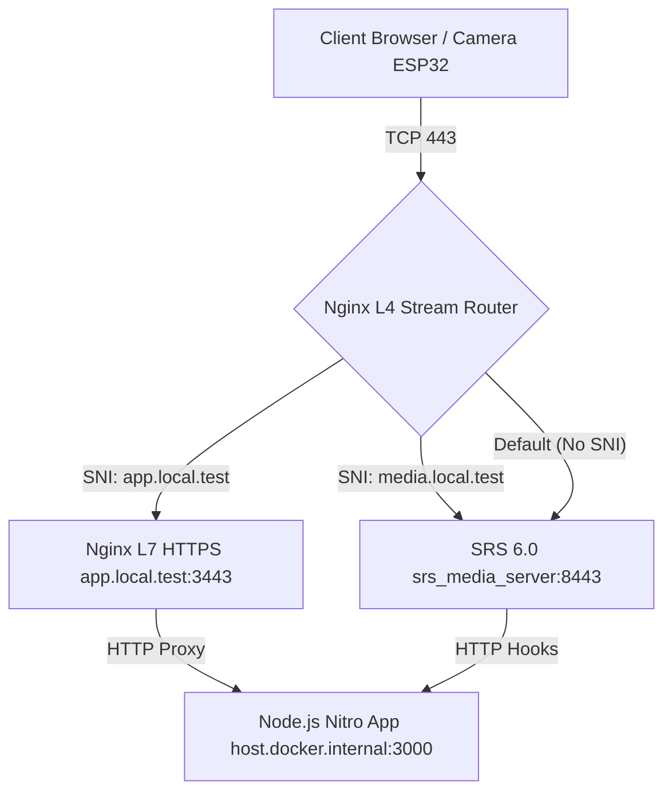

# System Design Specification: Phase 3 Gateway Integration (Nginx SNI Routing)

**Author:** Antigravity (Advanced Agentic Coding AI)
**Status:** APPROVED
**Date:** 2026-05-27

---

## 1. Executive Summary & Architecture Goal

The primary goal of **Phase 3: Gateway Integration** is to achieve **industrial-grade security and single-port ingress convergence** for the HomeGuard-RTC system. 

Instead of exposing multiple stream and api ports directly to public or local networks (which broadens the threat vector and scans target points), we consolidate all public traffic (HTTPS Web UI, API, WebSocket signaling, and WebRTC over TCP media) through a **single TCP `443` port** utilizing an **Nginx Stream SNI-routing Gateway**.

### Core Architecture Characteristics
* **Zero Public Media Ports**: All ports for SRS (`1935`, `1985`, `8080`, `8443`) are completely hidden behind the private Docker bridge network.
* **Non-decrypting L4 routing**: Nginx pre-reads the SNI (Server Name Indication) in TLS Client Hellos to route traffic to the appropriate backend without performing expensive TLS decryption on WebRTC media streams (preserving low latency and high bandwidth).
* **Smooth Local HTTPS (mkcert)**: Generates highly-secure, browser-trusted local development SSL certificates mapping local domains to the Docker network container ingress.

---

## 2. Global Ingress Topology

We partition our services using local virtual domains to route L4 SNI requests:
* **`app.local.test`** -> Pointing to the Node.js Nitro backend server (running on host port `3000`).
* **`media.local.test`** -> Pointing to the SRS stream media server container (handling signaling APIs and WebRTC TCP media).

### L4 SNI Router Map & Ports



---

## 3. Component Configuration Files

### 3.1 Nginx Gateway Configuration (`nginx.conf`)
Location in workspace: `c:\Users\Alone\working\ai-cam-new\ai-cam\nginx\nginx.conf`

```nginx
user nginx;
worker_processes auto;
error_log /var/log/nginx/error.log error;
pid /var/run/nginx.pid;

events {
    worker_connections 1024;
}

# =========================================================================
# L4 Stream SNI Router (Single TCP 443 Ingress)
# =========================================================================
stream {
    ssl_preread on;

    map $ssl_preread_server_name $backend_target {
        app.local.test     nginx_l7_app;
        media.local.test   srs_l4_media;
        default            srs_l4_media;
    }

    upstream nginx_l7_app {
        server 127.0.0.1:3443;
    }

    upstream srs_l4_media {
        server srs_media_server:8443;
    }

    server {
        listen 443;
        proxy_pass $backend_target;
        proxy_timeout 10m;
        proxy_connect_timeout 30s;
    }
}

# =========================================================================
# L7 HTTP/HTTPS Decryption & Reverse Proxy
# =========================================================================
http {
    include /etc/nginx/mime.types;
    default_type application/octet-stream;
    
    access_log off;
    sendfile on;
    keepalive_timeout 65;

    # SSL Termination for the Web UI & Control Plane API
    server {
        listen 127.0.0.1:3443 ssl;
        server_name app.local.test;

        ssl_certificate /etc/nginx/certs/local.test.pem;
        ssl_certificate_key /etc/nginx/certs/local.test-key.pem;

        ssl_protocols TLSv1.2 TLSv1.3;
        ssl_ciphers HIGH:!aNULL:!MD5;

        # Main App & API Reverse Proxy
        location / {
            proxy_pass http://host.docker.internal:3000;
            
            # WebSocket Support for Control Signaling Channel
            proxy_http_version 1.1;
            proxy_set_header Upgrade $http_upgrade;
            proxy_set_header Connection "upgrade";
            
            # Client IP Propagation
            proxy_set_header Host $host;
            proxy_set_header X-Real-IP $remote_addr;
            proxy_set_header X-Forwarded-For $proxy_add_x_forwarded_for;
            proxy_set_header X-Forwarded-Proto $scheme;
        }
    }
}
```

### 3.2 Upgraded流媒体配置 (`srs.conf` adaptation)
Location in workspace: `c:\Users\Alone\working\ai-cam-new\ai-cam\srs.conf`

```text
# SRS 6.0 Core Configuration for Single-Port WebRTC over TCP

listen              1935;
max_connections     1000;
daemon              off;
srs_log_tank        console;

http_server {
    enabled         on;
    listen          8080;
    dir             ./objs/nginx/html;
}

http_api {
    enabled         on;
    listen          1985;
}

# HTTPS Server for WHEP/WHIP APIs
https_server {
    enabled         on;
    listen          8443;
    key             ./conf/certs/local.test-key.pem;
    cert            ./conf/certs/local.test.pem;
}

stats {
    network         0;
}

stream_caster {
    enabled         off;
}

vhost __defaultVhost__ {
    # HTTP Hooks for Access Control List (ACL) callbacks
    http_hooks {
        enabled         on;
        on_publish      http://host.docker.internal:3000/internal/srs/on-publish;
        on_play         http://host.docker.internal:3000/internal/srs/on-play;
        on_stop         http://host.docker.internal:3000/internal/srs/on-stop;
    }

    rtc {
        enabled     on;
        bframe      discard;
    }
}

# WebRTC TCP server listening on same internal SSL port
rtc_server {
    enabled         on;
    protocol        tcp;
    candidate       media.local.test;
    
    tcp {
        enabled     on;
        listen      8443;
    }
}
```

---

## 4. Orchestration & Mount Design (`docker-compose.yml`)

Location in workspace: `c:\Users\Alone\working\ai-cam-new\ai-cam\docker-compose.yml`

```yaml
version: "3.9"

services:
  # Nginx Gateway Ingress
  nginx:
    image: nginx:1.25-alpine
    container_name: nginx_gateway
    ports:
      - "443:443"
    volumes:
      - ./nginx/nginx.conf:/etc/nginx/nginx.conf:ro
      - ./nginx/certs:/etc/nginx/certs:ro
    restart: always
    depends_on:
      - srs
    extra_hosts:
      - "host.docker.internal:host-gateway"
    networks:
      - homeguard_net

  # Secure SRS Media Instance
  srs:
    image: ossrs/srs:6
    container_name: srs_media_server
    # Ports are fully internal to bridge network
    volumes:
      - ./srs.conf:/usr/local/srs/conf/srs.conf
      - ./nginx/certs:/usr/local/srs/conf/certs:ro
    command: ["./objs/srs", "-c", "conf/srs.conf"]
    restart: always
    extra_hosts:
      - "host.docker.internal:host-gateway"
    networks:
      - homeguard_net

networks:
  homeguard_net:
    driver: bridge
```

---

## 5. Verification & Testing Protocol

To ensure correctness and rule out regressions, the following step-by-step verification protocol must be run:

1. **Local Trust Integration**:
   * Execute `mkcert -install` and generate certs inside `nginx/certs/`.
   * Add `app.local.test` and `media.local.test` to hosts.
2. **Launch & Routing Verification**:
   * Start docker services: `docker compose up -d`.
   * Run Nitro-app server on port `3000`.
   * Navigate to `https://app.local.test/api/hello` to confirm the browser trusts the connection and Nginx successfully proxies to Nitro on host.
3. **WebRTC Stream Playback & TCP Candidate Verification**:
   * Initiate WHIP publishing via `whip-whep-test.html` on `https://media.local.test/rtc/v1/whip/`.
   * Inspect the returned SDP Candidates to ensure the generated candidates point exclusively to `media.local.test` on port `443` over `TCP` (UDP candidate generation must be zero).
